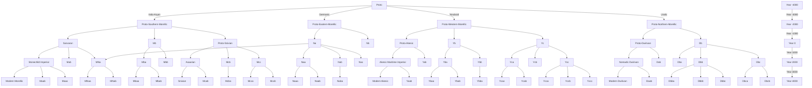

%%
What is it?
What does it do?
What does it look / sound / smell like?
What is it used for?
What is its cultural significance?
%%

## Tree

```mermaid
flowchart TD
    Proto --> |Indo-Aryan| M[Proto-Southern-Morellic]
        M --> Ma[Sarvaran]
            Ma --> Maa[Stonechild Imperial]
                Maa --> Maaa[Modern Morellic]
                Maa --> Maab
                Maa --> Maac
            Ma --> Mab
            Ma --> MNa
                MNa --> MNaa
                MNa --> MNab
        M --> Mb
            Mb --> Mba
                Mba --> Mbaa
                Mba --> Mbab
            Mb --> Mbb
        M --> Mc[Proto-Snixian]
            Mc --> Mca[Asaarian]
                Mca --> Mcaa[Snixian]
                Mca --> Mcab
            Mc --> Mcb
                Mcb --> Mcba
            Mc --> Mcc
                Mcc --> Mcca
                Mcc --> Mccb
    Proto --> |Germanic| N[Proto-Eastern-Morellic]
        N --> Na
            Na --> Naa
                Naa --> Naaa
                Naa --> Naab
            Na --> Nab
                Nab --> Naba
            Na --> Nac
            Na --> MNa
        N --> Nb
    Proto --> |Yoruboid| Y[Proto-Western-Morellic]
        Y --> Ya[Proto-Akesic]
            Ya --> Yaa[Akesic Maritime Imperial]
                Yaa --> Yaaa[Modern Akesic]
                Yaa --> Yaab
            Ya --> Yab
        Y --> Yb
            Yb --> Yba
                Yba --> Ybaa
                Yba --> Ybab
            Yb --> Ybb
                Ybb --> Ybba
        Y --> Yc
            Yc --> Yca
                Yca --> Ycaa
                Yca --> Ycab
            Yc --> Ycb
            Yc --> Ycc
                Ycc --> Ycca
                Ycc --> Yccb
                Ycc --> Yccc
    Proto --> |Uralic| D[Proto-Northern-Morellic]
        D --> Da[Proto-Dwirivan]
            Da --> Daa[Nomadic Dwirivan]
                Daa --> Daaa[Modern Dwirivan]
                Daa --> Daab
            Da --> Dab
        D --> Db
            Db --> Dba
            Db --> Dbb
                Dbb --> Dbba
                Dbb --> Dbbb
                Dbb --> Dbbc
            Db --> Dbc
                Dbc --> Dbca
                Dbc --> Dbcb
    time1[Year -4000] --> |Year -3000| time2[Year -2000] --> |Year -1000| time3[Year 0] --> |Year 1000| time4[Year 2000] --> |Year 3000| time5[Year 4000]
```